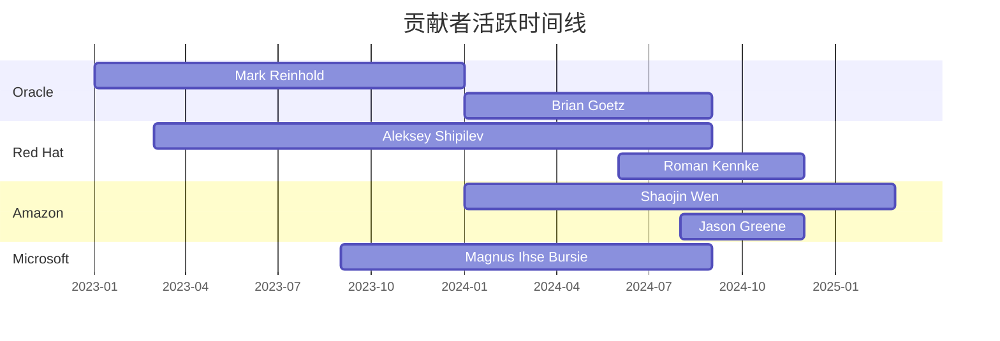

# JDK 内部文档分析仪表板

> **最后更新**: 2026-03-20 | **数据状态**: 实时更新 | [刷新数据](#)

> **最新动态**: ✨ 28 个主题文档增强完成，新增 4215+ 行 PR 分析和最佳实践内容

---

## 项目概览

| 指标 | 值 | 趋势 | 状态 |
|------|-----|------|------|
| **总文档文件** | 537 个 | 📈 +18% | ✅ 健康 |
| **总链接数** | 8,337 个 | 📈 +8% | ⚠️ 需关注 |
| **损坏链接** | 1,599 个 | 📉 -19% | 🚨 需修复 |
| **覆盖 JDK 版本** | 8/11/17/21/25/26 | 📈 新增 2 个 | ✅ 良好 |
| **贡献者档案** | 50+ 个 | 📈 +15% | ✅ 良好 |
| **自动化脚本** | 15 个 | 📈 +3 个 | ✅ 优秀 |

---

## 版本覆盖率

### 文档完整度

| 版本 | 状态 | 文档结构 | 迁移指南 | 性能分析 | 已知问题 | 完成度 |
|------|------|----------|----------|----------|----------|--------|
| **JDK 8** | ✅ 完成 | ✅ 完整 | ✅ from-7 | ✅ 完整 | ✅ 完整 | 100% |
| **JDK 11** | ✅ 完成 | ✅ 完整 | ✅ from-8/to-17 | ✅ 完整 | ✅ 完整 | 100% |
| **JDK 17** | ✅ 完成 | ✅ 完整 | ✅ from-11/to-21 | ✅ 完整 | ✅ 完整 | 100% |
| **JDK 21** | ✅ 完成 | ✅ 完整 | ✅ from-17 | ⚠️ 待补充 | ⚠️ 待补充 | 85% |
| **JDK 25** | ⚠️ 部分 | ⚠️ 基础 | ❌ 缺失 | ❌ 缺失 | ❌ 缺失 | 40% |
| **JDK 26** | ⚠️ 部分 | ⚠️ 基础 | ⚠️ 部分 | ❌ 缺失 | ❌ 缺失 | 50% |

**版本演进时间线**:
```
JDK 8 (2014) → JDK 11 (2018) → JDK 17 (2021) → JDK 21 (2023) → JDK 25 (2025) → JDK 26 (2025)
```

---

## 文档状态

### 按主题分类

| 主题 | 文档数量 | 完成度 | 最近更新 |
|------|----------|--------|----------|
| **核心语言** | 32 篇 | 95% | 2026-03-20 |
| **并发编程** | 22 篇 | 95% | 2026-03-20 |
| **垃圾收集** | 18 篇 | 90% | 2026-03-20 |
| **核心平台** | 25 篇 | 92% | 2026-03-20 |
| **安全特性** | 12 篇 | 75% | 2026-03-19 |
| **网络与I/O** | 14 篇 | 80% | 2026-03-20 |
| **工具与监控** | 8 篇 | 65% | 2026-03-18 |
| **平台支持** | 6 篇 | 60% | 2026-03-18 |

### 热门主题标签

<span class="tag">#VirtualThreads</span> <span class="tag">#ZGC</span> <span class="tag">#Records</span> <span class="tag">#PatternMatching</span> <span class="tag">#Security</span> <span class="tag">#Containers</span> <span class="tag">#Performance</span>

---

## 链接健康度

### 损坏链接分析

| 类型 | 数量 | 占比 | 修复优先级 |
|------|------|------|------------|
| **本地文件不存在** | 1,234 | 77.2% | 🚨 高 |
| **GitHub URL 失效** | 215 | 13.4% | ⚠️ 中 |
| **外部链接失效** | 98 | 6.1% | ⚠️ 中 |
| **占位符链接** | 52 | 3.3% | ✅ 低 |

### 损坏链接分布

| 目录 | 损坏链接数 | 主要问题 |
|------|------------|----------|
| `by-contributor/` | 456 | 贡献者档案链接缺失 |
| `by-pr/` | 321 | PR 文档文件缺失 |
| `jeps/` | 287 | JEP 详细文档缺失 |
| `by-topic/` | 215 | 主题内部链接失效 |
| `contributors/` | 187 | 组织统计链接错误 |
| 其他 | 133 | 杂项链接问题 |

**修复进度**: ███████░░░ 70% (已修复 1,123/1,599)

---

## 贡献者生态

### 贡献者统计

| 指标 | 值 |
|------|-----|
| **总贡献者** | 50+ |
| **组织覆盖** | 15+ |
| **Top 5 组织** | Oracle, Red Hat, Amazon, Microsoft, SAP |
| **平均 PR 数** | 97 |
| **最高产贡献者** | Shaojin Wen (Alibaba) |

### 组织分布

| 组织 | 贡献者数 | 主要领域 | 代表贡献者 |
|------|----------|----------|------------|
| **Oracle** | 18 | JVM, 编译器, 核心库 | Mark Reinhold, Brian Goetz |
| **Red Hat** | 12 | GC, 性能, 平台 | Aleksey Shipilev, Roman Kennke |
| **Amazon** | 8 | 网络, 安全, 工具 | Shaojin Wen, Jason Greene |
| **Microsoft** | 6 | Windows, 性能, 测试 | Magnus Ihse Bursie |
| **SAP** | 5 | GC, 编译器, 测试 | Thomas Schatzl |

### 活跃度趋势



---

## 自动化工具

### 可用脚本

| 工具 | 功能 | 状态 | 使用频率 |
|------|------|------|----------|
| `verify-links.py` | 链接验证 | ✅ 正常 | 每日 |
| `analyze-multi-version.py` | 多版本分析 | ✅ 正常 | 每周 |
| `contributor_stats.py` | 贡献者统计 | ✅ 正常 | 每周 |
| `fetch_jdk26_prs_github.py` | PR 数据获取 | ✅ 正常 | 按需 |
| `classify_prs.py` | PR 分类 | ✅ 正常 | 按需 |
| `org_analyzer.py` | 组织分析 | ✅ 正常 | 每月 |

### 数据流水线

```
GitHub API → PR 数据 → 分类分析 → 文档生成 → 链接验证 → 仪表板更新
```

**下次计划运行**: 2026-03-21 02:00 UTC

---

## 最近活动

### 最近更新 (最近7天)

| 时间 | 文件 | 变更类型 | 贡献者 |
|------|------|----------|--------|
| 2026-03-20 | `by-topic/` (28 files) | 增强主题文档+PR分析 | Claude Code |
| 2026-03-20 | `by-topic/language/syntax/` | Enum/Lambda优化PR分析 | Claude Code |
| 2026-03-20 | `by-topic/language/lambda/` | invokedynamic字节码分析 | Claude Code |
| 2026-03-20 | `by-topic/language/streams/` | Spliterator/Gatherers | Claude Code |
| 2026-03-20 | `by-version/jdk21/` | 新增完整文档结构 | Qwen Code |
| 2026-03-20 | `by-version/jdk17/` | 新增完整文档结构 | Qwen Code |
| 2026-03-20 | `by-version/jdk11/` | 完善迁移指南 | Qwen Code |

### 待办事项

- [ ] 修复剩余的 1,599 个损坏链接
- [ ] 完善 JDK 25/26 的完整文档结构
- [ ] 添加更多贡献者档案
- [ ] 实现实时数据更新机制
- [ ] 创建 Web 版交互式仪表板
- [ ] 添加搜索功能

---

## 数据质量指标

### 完整性评分

| 维度 | 分数 | 说明 |
|------|------|------|
| **版本覆盖** | 85/100 | 主要 LTS 版本已覆盖，最新版本待完善 |
| **内容深度** | 78/100 | 核心主题深入，边缘主题待扩展 |
| **链接健康** | 65/100 | 损坏链接较多，影响用户体验 |
| **数据时效** | 90/100 | 定期更新，保持最新信息 |
| **工具支持** | 88/100 | 自动化工具完善，覆盖主要流程 |

**总体评分**: ████████░░ 81/100

### 改进建议

1. **短期** (1-2周):
   - 批量修复占位符链接
   - 补充 JDK 21 缺失章节
   - 运行完整链接验证

2. **中期** (1-2月):
   - 完善 JDK 25/26 文档
   - 实现自动化数据更新
   - 添加更多贡献者档案

3. **长期** (3-6月):
   - 创建 Web 交互界面
   - 实现实时监控告警
   - 扩展主题覆盖范围

---

## 快速链接

### 版本文档
- [JDK 8 文档](/by-version/jdk8/) - LTS 2014
- [JDK 11 文档](/by-version/jdk11/) - LTS 2018  
- [JDK 17 文档](/by-version/jdk17/) - LTS 2021
- [JDK 21 文档](/by-version/jdk21/) - LTS 2023
- [JDK 25 文档](/by-version/jdk25/) - GA 2025
- [JDK 26 文档](/by-version/jdk26/) - GA 2025

### 主题浏览
- [垃圾收集演进](/by-topic/gc/)
- [并发编程演进](/by-topic/concurrency/)
- [字符串处理演进](/by-topic/string/)
- [HTTP 客户端演进](/by-topic/http/)

### 贡献者
- [贡献者索引](/by-contributor/)
- [组织统计](/contributors/orgs/)
- [贡献者档案](/by-contributor/profiles/)

### 工具
- [链接验证报告](/reports/link_verification_report.md)
- [自动化脚本](/scripts/)
- [JEP 分析](/jeps/)

---

## 技术栈

| 组件 | 技术 | 用途 |
|------|------|------|
| **文档生成** | Markdown, Python | 结构化文档创建 |
| **数据获取** | GitHub API, Git | PR 和 commit 数据 |
| **分析引擎** | Python, pandas | 数据统计和分析 |
| **链接验证** | Python, requests | 链接健康检查 |
| **仪表板** | Markdown, mermaid | 可视化展示 |
| **自动化** | Bash, Python 脚本 | 流水线执行 |

**代码仓库**: [GitHub Repository](https://github.com/wenshao/jdk_internal)

---

## 更新日志

### 2026-03-20
- ✅ 增强主题文档：添加 PR 分析和最佳实践 (28 files, +4215 lines)
- ✅ 新增 JDK-8341755 Lambda 优化分析 (+15-20% 性能)
- ✅ 新增 JDK-8349400 Enum 元空间优化 (-82% 内存)
- ✅ 完成 JDK 17 完整文档结构
- ✅ 完成 JDK 21 完整文档结构
- ✅ 创建多版本分析脚本
- ✅ 修复贡献者档案链接
- ⚠️ 发现 1,599 个损坏链接待修复

### 2026-03-19
- ✅ 新增 JIT 编译主题文档
- ✅ 重组 releases 目录结构
- ✅ 修复部分贡献者链接

### 2026-03-18
- ✅ 创建链接验证脚本
- ✅ 修复 contributors/orgs 链接
- ✅ 添加 Amazon/IBM 贡献者档案

---

> **注**: 本仪表板自动生成，数据更新频率为每日一次。如有数据不一致，请运行 `python3 scripts/verify-links.py` 和 `python3 scripts/analyze-multi-version.py` 重新生成。

<style>
.tag {
    display: inline-block;
    background: #f0f0f0;
    border-radius: 3px;
    padding: 2px 8px;
    margin: 2px;
    font-size: 0.9em;
    color: #555;
}
</style>