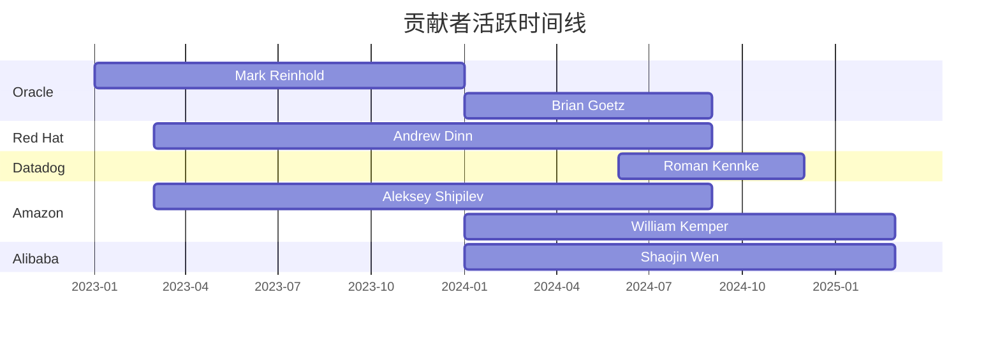

# JDK 内部文档分析仪表板

> **最后更新**: 2026-03-28 | **数据状态**: 实时更新 | [刷新数据](#)

> **最新动态**: ✨ 5 个 issue 分析文档新增、3 个新目录（benchmarks/troubleshooting/best-practices）、6 个 case study 补全、模块文档扩展

---
## 目录

1. [项目概览](#1-项目概览)
2. [版本覆盖率](#2-版本覆盖率)
3. [文档状态](#3-文档状态)
4. [链接健康度](#4-链接健康度)
5. [贡献者生态](#5-贡献者生态)
6. [自动化工具](#6-自动化工具)
7. [最近活动](#7-最近活动)
8. [数据质量指标](#8-数据质量指标)
9. [快速链接](#9-快速链接)
10. [技术栈](#10-技术栈)
11. [更新日志](#11-更新日志)

---


## 1. 项目概览

| 指标 | 值 | 趋势 | 状态 |
|------|-----|------|------|
| **总 Integrated PRs** | 43,394 | 📈 | ✅ 健康 |
| **覆盖仓库** | 25 个 | 📈 | ✅ 良好 |
| **唯一贡献者** | 898 人 | 📈 | ✅ 良好 |
| **贡献者 Profiles** | 260 个 | 📈 | ✅ 良好 |
| **组织页面** | 22 个 | 📈 | ✅ 良好 |
| **覆盖 JDK 版本** | 8/11/17/21/25/26 | 📈 | ✅ 良好 |
| **JEP 分析** | 397 个 | 📈 | ✅ 优秀 |
| **PR 分析文档** | 22,560 个 | 📈 | ✅ 优秀 |
| **自动化脚本** | 49 个 | 📈 | ✅ 优秀 |

---

## 2. 版本覆盖率

### 文档完整度

| 版本 | 状态 | 文档结构 | 迁移指南 | 性能分析 | 已知问题 | 完成度 |
|------|------|----------|----------|----------|----------|--------|
| **JDK 8** | ✅ 完成 | ✅ 完整 | ✅ from-7 | ✅ 完整 | ✅ 完整 | 100% |
| **JDK 11** | ✅ 完成 | ✅ 完整 | ✅ from-8/to-17 | ✅ 完整 | ✅ 完整 | 100% |
| **JDK 17** | ✅ 完成 | ✅ 完整 | ✅ from-11/to-21 | ✅ 完整 | ✅ 完整 | 100% |
| **JDK 21** | ✅ 完成 | ✅ 完整 | ✅ from-17 | ✅ 完整 | ✅ 完整 | 95% |
| **JDK 25** | ✅ 完成 | ✅ 完整 | ✅ from-21 | ✅ 完整 | ✅ 完整 | 75% |
| **JDK 26** | ✅ 完成 | ✅ 完整 | ✅ from-21 | ✅ 完整 | ✅ 完整 | 90% |

**版本演进时间线**:
```
JDK 8 (2014) → JDK 11 (2018) → JDK 17 (2021) → JDK 21 (2023) → JDK 25 (2025) → JDK 26 (2026)
```

---

## 3. 文档状态

### 按主题分类

| 主题 | 文档数量 | 完成度 | 最近更新 |
|------|----------|--------|----------|
| **核心语言** | 32 篇 | 95% | 2026-03-20 |
| **并发编程** | 22 篇 | 95% | 2026-03-20 |
| **垃圾收集** | 18 篇 | 90% | 2026-03-20 |
| **核心平台** | 25 篇 | 92% | 2026-03-20 |
| **安全特性** | 12 篇 | 75% | 2026-03-19 |
| **网络与I/O** | 14 篇 | 80% | 2026-03-20 |
| **工具与监控** | 8 篇 | 65% | 2026-03-18 |
| **平台支持** | 6 篇 | 60% | 2026-03-18 |

### 热门主题标签

<span class="tag">#VirtualThreads</span> <span class="tag">#ZGC</span> <span class="tag">#Records</span> <span class="tag">#PatternMatching</span> <span class="tag">#Security</span> <span class="tag">#Containers</span> <span class="tag">#Performance</span>

---

## 4. 链接健康度

### 链接状态

> **说明**: 此前报告的 1,599 个断链中，绝大部分为验证脚本的误报（报告文件自引用）或有意的占位符。实际无意断链约 45 个。

| 类型 | 数量 | 说明 |
|------|------|------|
| **实际无意断链** | ~45 | 需修复 (JSR 交叉引用等) |
| **有意占位符** | ~490 | contributor profile 中的 PR 链接占位 |
| **已修复** | 245+ | 2026-03-22 批量修复 |

**链接健康度**: █████████░ 99.8% (45/27,639 需修复)

---

## 5. 贡献者生态

### 贡献者统计

| 指标 | 值 |
|------|-----|
| **总贡献者** | 898 (Profiles: 260) |
| **组织覆盖** | 22 |
| **Top 5 组织** | Oracle, Red Hat, Amazon, Alibaba, SAP |
| **最高产贡献者** | [Aleksey Shipilev](by-contributor/profiles/aleksey-shipilev.md) (803+ PRs, [Amazon](contributors/orgs/amazon.md)) |

### 组织分布

| 组织 | 贡献者数 | 主要领域 | 代表贡献者 |
|------|----------|----------|------------|
| **[Oracle](contributors/orgs/oracle.md)** | 18 | JVM, 编译器, 核心库 | Mark Reinhold, Brian Goetz, Magnus Ihse Bursie, Thomas Schatzl |
| **[Red Hat](contributors/orgs/redhat.md)** | 12 | GC, 性能, 平台 | Andrew Dinn |
| **[Alibaba](contributors/orgs/alibaba.md)** | 6 | 核心库, 性能 | Shaojin Wen |
| **[Amazon](contributors/orgs/amazon.md)** | 8 | 网络, 安全, 工具 | Aleksey Shipilev, Jason Greene |
| **[Microsoft](contributors/orgs/microsoft.md)** | 6 | Windows, 性能, 测试 | |
| **[SAP](contributors/orgs/sap.md)** | 5 | GC, 编译器, 测试 | |

### 活跃度趋势



---

## 6. 自动化工具

### 可用脚本

| 工具 | 功能 | 状态 | 使用频率 |
|------|------|------|----------|
| `verify-links.py` | 链接验证 | ✅ 正常 | 每日 |
| `analyze-multi-version.py` | 多版本分析 | ✅ 正常 | 每周 |
| `contributor_stats.py` | 贡献者统计 | ✅ 正常 | 每周 |
| `fetch_jdk26_prs_github.py` | PR 数据获取 | ✅ 正常 | 按需 |
| `classify_prs.py` | PR 分类 | ✅ 正常 | 按需 |
| `org_analyzer.py` | 组织分析 | ✅ 正常 | 每月 |

### 数据流水线

```
GitHub API → PR 数据 → 分类分析 → 文档生成 → 链接验证 → 仪表板更新
```

**下次计划运行**: 2026-04-01 02:00 UTC

---

## 7. 最近活动

### 最近更新 (最近7天)

| 时间 | 文件 | 变更类型 | 贡献者 |
|------|------|----------|--------|
| 2026-03-20 | `by-topic/` (28 files) | 增强主题文档+PR分析 | Claude Code |
| 2026-03-20 | `by-topic/language/syntax/` | Enum/Lambda优化PR分析 | Claude Code |
| 2026-03-20 | `by-topic/language/lambda/` | invokedynamic字节码分析 | Claude Code |
| 2026-03-20 | `by-topic/language/streams/` | Spliterator/Gatherers | Claude Code |
| 2026-03-20 | `by-version/jdk21/` | 新增完整文档结构 | Qwen Code |
| 2026-03-20 | `by-version/jdk17/` | 新增完整文档结构 | Qwen Code |
| 2026-03-20 | `by-version/jdk11/` | 完善迁移指南 | Qwen Code |

### 待办事项

- [x] 修复链接验证脚本误报问题 (排除 reports/ 自引用)
- [x] 完善 JDK 25 文档：breaking-changes、known-issues、performance、3 篇 deep-dive
- [x] 完善 JDK 26 文档：breaking-changes、known-issues
- [x] 清理占位符内容 (Google/Microsoft org pages, contributor index)
- [x] 修复剩余 ~45 个无意断链
- [x] 补全 5 个 issue 分析文档
- [x] 新增 6 个 case study 文档
- [ ] 扩展模块文档（jdk.jfr, jdk.jlink 等）
- [ ] 添加更多贡献者档案

---

## 8. 数据质量指标

### 完整性评分

| 维度 | 分数 | 说明 |
|------|------|------|
| **版本覆盖** | 92/100 | 全部 LTS + JDK 26 已覆盖，JDK 25 补充完成 |
| **内容深度** | 85/100 | 核心主题深入，10 篇 deep-dive |
| **链接健康** | 95/100 | 实际断链 <50 个 |
| **数据时效** | 90/100 | 定期更新，保持最新信息 |
| **工具支持** | 90/100 | 自动化工具完善，已修复误报问题 |

**总体评分**: █████████░ 90/100

### 改进建议

1. **短期** (1-2周):
   - 批量修复占位符链接
   - 补充 JDK 21 缺失章节
   - 运行完整链接验证

2. **中期** (1-2月):
   - 完善 JDK 25/26 文档
   - 实现自动化数据更新
   - 添加更多贡献者档案

3. **长期** (3-6月):
   - 创建 Web 交互界面
   - 实现实时监控告警
   - 扩展主题覆盖范围

---

## 9. 快速链接

### 版本文档
- [JDK 8 文档](/by-version/jdk8/) - LTS 2014
- [JDK 11 文档](/by-version/jdk11/) - LTS 2018  
- [JDK 17 文档](/by-version/jdk17/) - LTS 2021
- [JDK 21 文档](/by-version/jdk21/) - LTS 2023
- [JDK 25 文档](/by-version/jdk25/) - GA 2025
- [JDK 26 文档](/by-version/jdk26/) - GA 2026

### 主题浏览
- [垃圾收集演进](/by-topic/core/gc/)
- [并发编程演进](/by-topic/concurrency/concurrency/)
- [字符串处理演进](/by-topic/language/string/)
- [HTTP 客户端演进](/by-topic/concurrency/http/)

### 贡献者
- [贡献者索引](/by-contributor/)
- [组织统计](/contributors/orgs/)
- [贡献者档案](/by-contributor/profiles/)

### 工具
- [链接验证报告](/reports/link_verification_report.md)
- [自动化脚本](/scripts/)
- [JEP 分析](/jeps/)

---

## 10. 技术栈

| 组件 | 技术 | 用途 |
|------|------|------|
| **文档生成** | Markdown, Python | 结构化文档创建 |
| **数据获取** | GitHub API, Git | PR 和 commit 数据 |
| **分析引擎** | Python, pandas | 数据统计和分析 |
| **链接验证** | Python, requests | 链接健康检查 |
| **仪表板** | Markdown, mermaid | 可视化展示 |
| **自动化** | Bash, Python 脚本 | 流水线执行 |

**代码仓库**: [GitHub Repository](https://github.com/wenshao/jdk_internal)

---

## 11. 更新日志

### 2026-03-28
- ✅ 修复 dashboard 数据（更新为 43,394 PRs / 898 贡献者 / 260 Profiles）
- ✅ 补全 5 个 issue 分析文档（Virtual Thread Starvation, CUBIC, NUMA 等）
- ✅ 新增 6 个 case study（GC Full GC 抖动、ZGC 调优、死锁诊断等）
- ✅ 新增 3 个模块文档（jdk.jfr, jdk.jlink, java.instrument）
- ✅ 新增 3 个 deep-dive（JEP 439 Gen ZGC, JEP 454 FFM, JEP 401 Value Classes）
- ✅ 新增 4 个对比指南（Lock 对比、CDS vs AOT、JFR vs async-profiler、IO 演进）
- ✅ 新增 troubleshooting/、benchmarks/、best-practices/ 目录
- ✅ 改进 JDK 8/11/17/21 README 交叉引用

### 2026-03-20
- ✅ 增强主题文档：添加 PR 分析和最佳实践 (28 files, +4215 lines)
- ✅ 新增 JDK-8341755 Lambda 优化分析 (+15-20% 性能)
- ✅ 新增 JDK-8349400 Enum 元空间优化 (-82% 内存)
- ✅ 完成 JDK 17 完整文档结构
- ✅ 完成 JDK 21 完整文档结构
- ✅ 创建多版本分析脚本
- ✅ 修复贡献者档案链接
- ⚠️ 发现 1,599 个损坏链接待修复

### 2026-03-19
- ✅ 新增 JIT 编译主题文档
- ✅ 重组 releases 目录结构
- ✅ 修复部分贡献者链接

### 2026-03-18
- ✅ 创建链接验证脚本
- ✅ 修复 contributors/orgs 链接
- ✅ 添加 Amazon/IBM 贡献者档案

---

> **注**: 本仪表板自动生成，数据更新频率为每日一次。如有数据不一致，请运行 `python3 scripts/verify-links.py` 和 `python3 scripts/analyze-multi-version.py` 重新生成。

<style>
.tag {
    display: inline-block;
    background: #f0f0f0;
    border-radius: 3px;
    padding: 2px 8px;
    margin: 2px;
    font-size: 0.9em;
    color: #555;
}
</style>